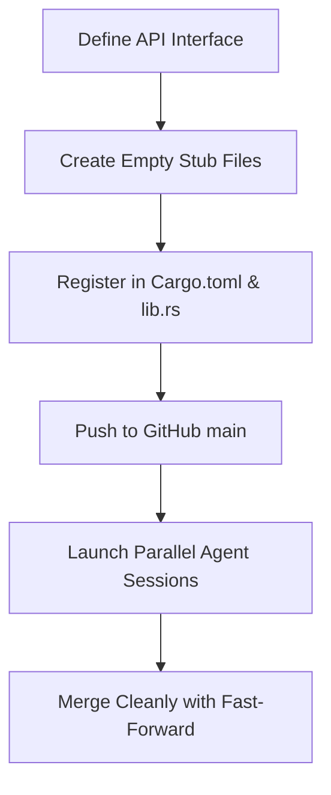

# Modularization Guidelines for AI Agent Development

To ensure multiple AI agents (e.g., Jules sessions) can work in parallel on `mem-profile` with **zero merge conflicts**, follow the guidelines in this document.

---

## 🛡️ Conflict-Free Parallel Workflow

When designing new features or parallelizing tasks, developers and agent coordinators must follow the **Stub-and-Push** model:

### 1. Pre-Registering Shared Files (The Baseline Commit)
Never let multiple parallel agents edit shared registry files like `Cargo.toml`, `src/lib.rs`, or `src/report.rs` in their branches. Instead, the coordinator must:
- Create empty stub files for each planned module (e.g., `touch src/my_feature.rs`).
- Register the module in `src/lib.rs` (e.g., `pub mod my_feature;`).
- Pre-add any expected external dependencies to `Cargo.toml`.
- Commit and **push this baseline to GitHub** before spawning the sessions.

### 2. Isolated Module Scoping
Each agent task must be strictly scoped to its own dedicated file:
- **No Shared Files**: An agent implementing `pprof` must only write to `src/pprof.rs`. It must not edit `src/report.rs`.
- **Glue Integration Deferred**: Any final integration code (the "glue" that connects features) should be left as a separate integration task *after* the parallel feature branches are merged.

---

## 🛠️ Code Architecture Rules

### 1. High Cohesion, Low Coupling
- Modules must be independent. For example, `flamegraph` should not import or depend on `pprof`.
- Expose clear, minimal API entry points (e.g., a single public function or struct) so that the integration layer remains trivial.

### 2. Isolated Testing
- Do not add unit tests to a shared global test file.
- Write unit tests **within the feature module** using an inline `mod tests` block (e.g. at the bottom of `src/pprof.rs`), or create a dedicated integration test file under `tests/` specifically for that feature (e.g., `tests/pprof_tests.rs`).

### 3. Shared State Access
- Any access to the global allocator or allocation registry must go through the public methods exposed by `Registry` or `ProfilingAllocator`.
- Never access raw static fields directly across modules.
