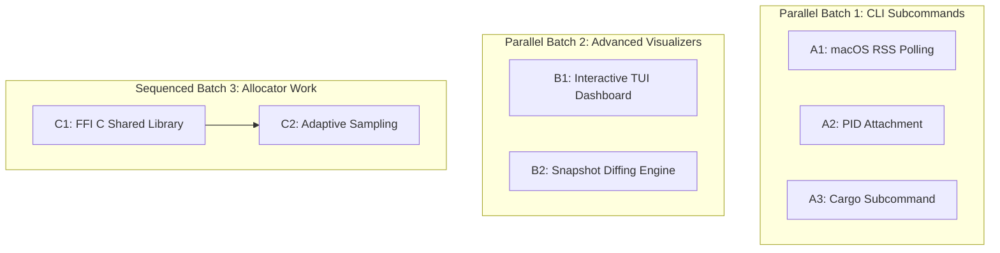

# 🗺️ Proposed Features & Parallelization Roadmap

This document groups future improvements for `mem-profile` into parallelizable batches, detailing which tasks can run concurrently and which must be sequenced to prevent merge conflicts.

---

## 🛠️ Task Groups & Parallelization Layout

All tasks are now **fully parallelizable** (zero risk of merge conflicts) because they operate in completely disjoint source files.

---

## 📋 Active Parallel Tasks & Sessions

### 📦 Batch 1: CLI Subcommands (Parallel)
*Now fully parallelizable because the CLI entry point [src/bin/mem-profile-cli.rs](file:///Users/kolajy/pg/projects/mem-profile/src/bin/mem-profile-cli.rs) has been refactored into library submodules.*

- **Task A1: macOS RSS Polling Compatibility**
  - *Designated File*: [src/cli/run.rs](file:///Users/kolajy/pg/projects/mem-profile/src/cli/run.rs)
  - *Session ID*: `4142171068930069717`
  - *Tracking URL*: [View Session](https://jules.google.com/session/4142171068930069717)
  - *Status*: 🏃 Active (Superseded `7515958101483478120`)
- **Task A2: PID Attachment Monitoring**
  - *Designated File*: [src/cli/attach.rs](file:///Users/kolajy/pg/projects/mem-profile/src/cli/attach.rs)
  - *Session ID*: `5860193119156037952`
  - *Tracking URL*: [View Session](https://jules.google.com/session/5860193119156037952)
  - *Status*: 🏃 Active
- **Task A3: Cargo Subcommand Integration**
  - *Designated File*: [src/cli/cargo.rs](file:///Users/kolajy/pg/projects/mem-profile/src/cli/cargo.rs)
  - *Session ID*: `8586421082671867085`
  - *Tracking URL*: [View Session](https://jules.google.com/session/8586421082671867085)
  - *Status*: 🏃 Active

---

### 🚀 Batch 2: Advanced Visualizers & Tooling (Parallel)
*These tasks operate in completely disjoint new modules. They can be executed concurrently in parallel.*

- **Task B1: Interactive TUI Dashboard**
  - *Designated File*: `src/tui.rs` (New module)
  - *Description*: Build a real-time console dashboard (with `ratatui`) showing allocation tables and memory growth charts.
- **Task B2: Snapshot Diffing Engine**
  - *Designated File*: `src/diff.rs` (New module)
  - *Description*: Build a CLI subcommand to compare two JSON heap snapshots to isolate leaked call stacks.
