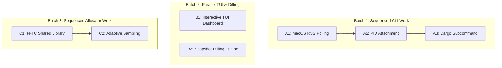

# 🗺️ Proposed Features & Parallelization Roadmap

This document groups future improvements for `mem-profile` into parallelizable batches, detailing which tasks can run concurrently and which must be sequenced to prevent merge conflicts.

---

## 🛠️ Task Groups & Interference Analysis

---

## 📅 Detailed Batches Breakdown

### 📦 Batch 1: CLI & OS Integration (Sequenced)
*These tasks have high file overlap on the CLI runner files. They must be executed **sequentially**.*

- **[Active] Task A1: macOS RSS Polling Compatibility**
  - *Files impacted*: [src/bin/mem-profile-cli.rs](file:///Users/kolajy/pg/projects/mem-profile/src/bin/mem-profile-cli.rs), [src/main.rs](file:///Users/kolajy/pg/projects/mem-profile/src/main.rs)
  - *Description*: Implement Mach task APIs for Apple Silicon/Intel macOS RSS gathering.
- **[Pending] Task A2: PID Attachment Monitoring**
  - *Files impacted*: [src/bin/mem-profile-cli.rs](file:///Users/kolajy/pg/projects/mem-profile/src/bin/mem-profile-cli.rs), [src/main.rs](file:///Users/kolajy/pg/projects/mem-profile/src/main.rs)
  - *Description*: Add `--pid <PID>` flag to track existing processes with OS liveness checks.
- **[Pending] Task A3: Cargo Subcommand Integration (`cargo-mem-profile`)**
  - *Files impacted*: [src/bin/mem-profile-cli.rs](file:///Users/kolajy/pg/projects/mem-profile/src/bin/mem-profile-cli.rs), [Cargo.toml](file:///Users/kolajy/pg/projects/mem-profile/Cargo.toml)
  - *Description*: Wrap the runner as a cargo plugin.

---

### 🚀 Batch 2: Advanced Visualizers & Tooling (Parallel)
*These tasks operate in completely disjoint new modules. They can be executed **concurrently in parallel**.*

- **Task B1: Interactive TUI Dashboard**
  - *Files impacted*: `src/tui.rs` (New module)
  - *Description*: Build a real-time console dashboard (with `ratatui`) showing allocation tables and memory growth charts.
  - *Status*: Ready for parallel launch.
- **Task B2: Snapshot Diffing Engine**
  - *Files impacted*: `src/diff.rs` (New module)
  - *Description*: Build a CLI subcommand to compare two JSON heap snapshots to isolate leaked call stacks.
  - *Status*: Ready for parallel launch.

---

### 🧠 Batch 3: Core Allocator Enhancements (Sequenced)
*These tasks modify the core hooking layer. They should be executed **sequentially**.*

- **Task C1: FFI C-Compatible Shared Library (`cdylib`)**
  - *Files impacted*: [Cargo.toml](file:///Users/kolajy/pg/projects/mem-profile/Cargo.toml), [src/allocator.rs](file:///Users/kolajy/pg/projects/mem-profile/src/allocator.rs), [src/lib.rs](file:///Users/kolajy/pg/projects/mem-profile/src/lib.rs)
  - *Description*: Export standard C symbols (`malloc`, `free`, `realloc`, `calloc`) to intercept allocations via dynamic preloading.
- **Task C2: Adaptive Sampling & Lock-Free Registry**
  - *Files impacted*: [src/allocator.rs](file:///Users/kolajy/pg/projects/mem-profile/src/allocator.rs)
  - *Description*: Integrate 1-in-N allocation sampling and lock-free arrays to mitigate lock contention.
