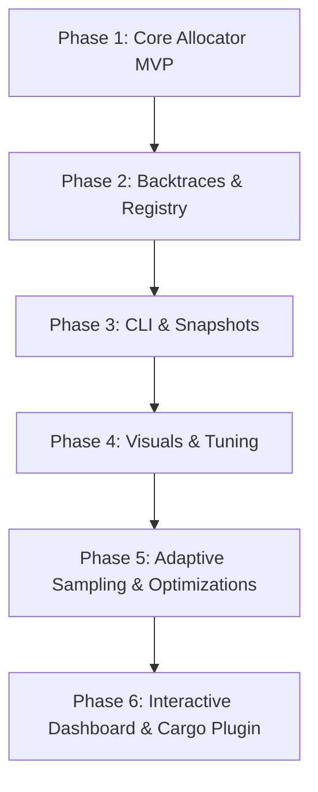

# Development Roadmap: `mem-profile`

This document outlines the release milestones for the `mem-profile` utility. Having completed the core allocator, CLI, and visualization features, this roadmap guides future performance optimizations and user interface enhancements.

---

---

## 📅 Milestones Overview

| Phase | Title | Description | Target Status |
| :--- | :--- | :--- | :--- |
| **Phase 1** | Core Allocator MVP | Custom allocator wrapper, stats tracking, reentrancy guards | ✅ Completed |
| **Phase 2** | Backtraces & Registry | Sharded pointer registry, lazy symbolication, leak dump | ✅ Completed |
| **Phase 3** | CLI & Snapshots | Signal handlers, runtime snapshots, CLI runner | ✅ Completed |
| **Phase 4** | Visualizations & Optimization | `pprof` export, flamegraphs, threshold alerts | ✅ Completed |
| **Phase 5** | Adaptive Sampling & Performance | Sampled profiling, lock-free registry, overhead mitigation | 📋 Planned |
| **Phase 6** | Dashboard & Tooling | Interactive HTML UI, `cargo mem-profile` subcommand | 📋 Planned |

---

## 🛠️ Detailed Breakdown

### Phase 1: Core Allocator MVP (Completed)
Focuses on intercepting memory allocation safely without causing program crashes or infinite loops.
- [x] Create `ProfilingAllocator` struct wrapping any inner `GlobalAlloc`.
- [x] Implement robust **reentrancy prevention** using thread-local storage flags (`Cell<bool>`).
- [x] Maintain atomic global counters for `active_bytes`, `total_allocations`, and `total_deallocations`.
- [x] Expose basic programmatic access to statistics (e.g., `mem_profile::active_bytes()`).
- [x] Add integration tests verifying tracking under basic allocation patterns (Box, Vec).

### Phase 2: Backtraces & Registry (Completed)
Introduces location tracking to find *where* memory is being allocated.
- [x] Implement sharded mutex hash maps to registry pointers to metadata.
- [x] Capture raw backtrace pointers at allocation time (using `backtrace` crate without symbolication).
- [x] Add symbolic indexing on program exit (lazy symbolication) to translate frame pointers to file/line/function names.
- [x] Build a leak detection reporter that scans the registry on shutdown and formats un-deallocated frames.
- [x] Introduce a clean up filter to omit `mem-profile` internal frame calls from reports.

### Phase 3: CLI Subcommand & Snapshots (Completed)
Makes profiling interactive and usable for external binaries.
- [x] Setup binary target `mem-profile-cli`.
- [x] Support dumping memory snapshots to disk via programmatic triggers (`mem_profile::dump()`).
- [x] Support signal listening (`SIGUSR1` / `SIGUSR2`) to dump snapshots during daemon operations.
- [x] Implement wrapper runner CLI allowing execution like: `mem-profile-cli run -- ./my_binary --arg1`.

### Phase 4: Visualizations & Optimization (Completed)
Enhances developer analysis through charts and industry-standard integrations.
- [x] Implement `pprof` protocol buffer export format.
- [x] Create simple SVG flamegraph renderer out of folded stack profiles.
- [x] Perform lock contention audits under heavy multi-threaded allocation tests.
- [x] Add threshold alerts that trigger callbacks when target memory usage is breached.

### Phase 5: Adaptive Sampling & Performance
Optimizes the profiler for production and high-throughput microservices.
- [ ] **Sampled Profiling**: Allow profiling only 1-in-N allocations or allocations larger than a threshold to minimize CPU overhead.
- [ ] **Lock-Free Registry**: Replace sharded mutexes with atomic-swapped arrays or lock-free skip-lists to eliminate thread lock contention under high concurrent loads.
- [ ] **Overhead Audits**: Benchmark overhead under heavy loads (e.g. running axum/actix-web web servers).

### Phase 6: Dashboard & Tooling
Ergonomics and graphical visualization for developer workflows.
- [ ] **Interactive HTML Dashboard**: Generate a single-file interactive web page displaying memory growth timelines, flamegraphs, and allocation tables.
- [ ] **Cargo Subcommand**: Create a cargo plugin wrapper to run profiling directly: `cargo mem-profile run --bin my_app`.
- [ ] **CI/CD Integration**: Add threshold assertions to fail CI builds if leak count or peak memory consumption breaches target limits.
