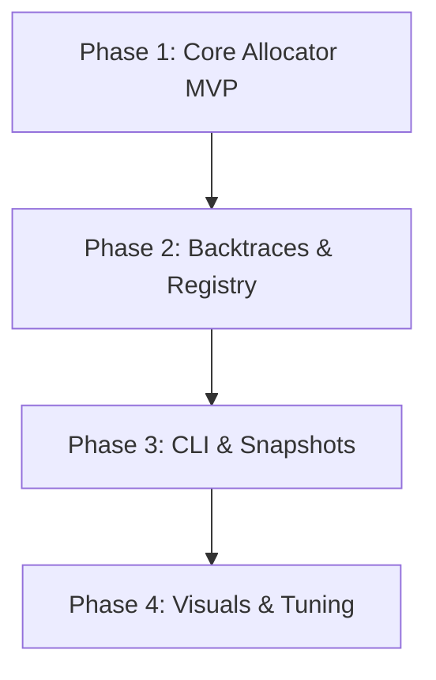

# Development Roadmap: `mem-profile`

This document outlines the planned release milestones for the `mem-profile` utility. Each phase represents a functional upgrade, taking the project from a basic heap tracker to a full-featured visualization tool.

---



---

## 📅 Milestones Overview

| Phase | Title | Description | Target Status |
| :--- | :--- | :--- | :--- |
| **Phase 1** | Core Allocator MVP | Custom allocator wrapper, stats tracking, reentrancy guards | ✅ Completed |
| **Phase 2** | Backtraces & Registry | Sharded pointer registry, lazy symbolication, leak dump | 📋 Planned |
| **Phase 3** | CLI & Snapshots | Signal handlers, runtime snapshots, CLI runner | 📋 Planned |
| **Phase 4** | Visualizations & Optimization | `pprof` export, flamegraphs, performance tuning | 📋 Planned |

---

## 🛠️ Detailed Breakdown

### Phase 1: Core Allocator MVP
Focuses on intercepting memory allocation safely without causing program crashes or infinite loops.
- [x] Create `ProfilingAllocator` struct wrapping any inner `GlobalAlloc`.
- [x] Implement robust **reentrancy prevention** using thread-local storage flags (`Cell<bool>`).
- [x] Maintain atomic global counters for `active_bytes`, `total_allocations`, and `total_deallocations`.
- [x] Expose basic programmatic access to statistics (e.g., `mem_profile::active_bytes()`).
- [x] Add integration tests verify tracking under basic allocation patterns (Box, Vec).

### Phase 2: Backtraces & Registry
Introduces location tracking to find *where* memory is being allocated.
- [ ] Implement sharded mutex hash maps to registry pointers to metadata.
- [ ] Capture raw backtrace pointers at allocation time (using `backtrace` crate without symbolication).
- [ ] Add symbolic indexing on program exit (lazy symbolication) to translate frame pointers to file/line/function names.
- [ ] Build a leak detection reporter that scans the registry on shutdown and formats un-deallocated frames.
- [ ] Introduce a clean up filter to omit `mem-profile` internal frame calls from reports.

### Phase 3: CLI Subcommand & Snapshots
Makes profiling interactive and usable for external binaries.
- [ ] Setup binary target `mem-profile-cli`.
- [ ] Support dumping memory snapshots to disk via programmatic triggers (`mem_profile::dump()`).
- [ ] Support signal listening (`SIGUSR1` / `SIGUSR2`) to dump snapshots during daemon operations.
- [ ] Implement wrapper runner CLI allowing execution like:
  ```bash
  mem-profile-cli run -- ./my_binary --arg1
  ```

### Phase 4: Visualizations & Optimization
Enhances developer analysis through charts and industry-standard integrations.
- [ ] Implement `pprof` protocol buffer export format.
- [ ] Create simple SVG flamegraph renderer out of folded stack profiles.
- [ ] Perform lock contention audits under heavy multi-threaded allocation tests.
- [ ] Add threshold alerts that trigger callbacks when target memory usage is breached.
